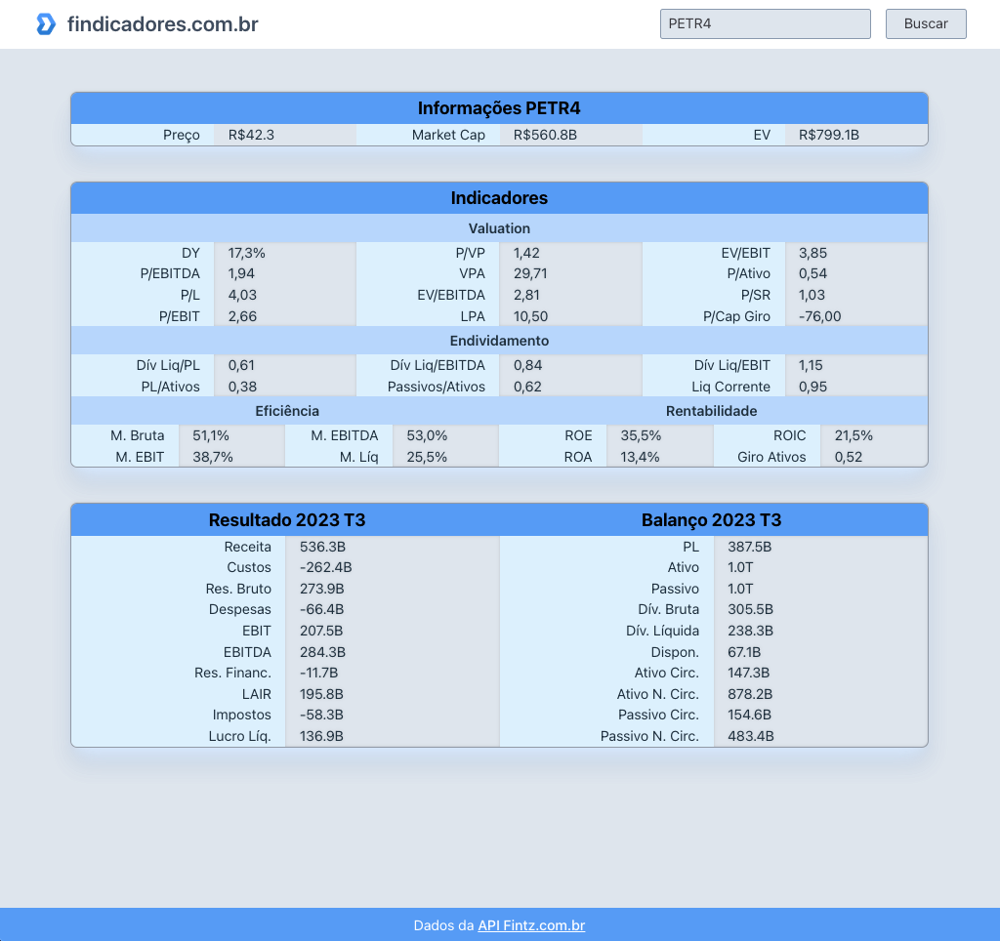
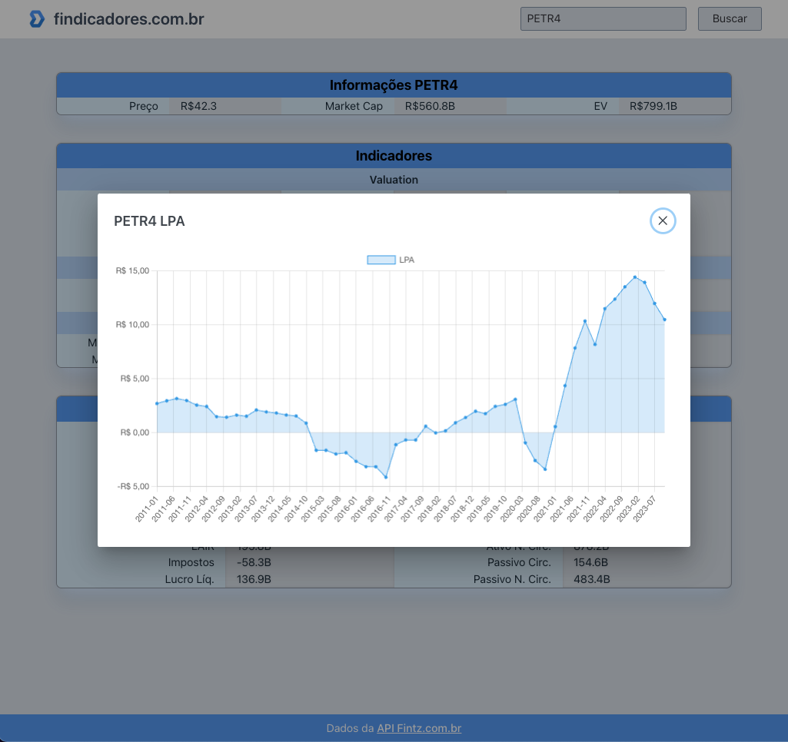

# Findicadores

Disponível em:
[https://gmbueno.github.io/findicadores/](https://gmbueno.github.io/findicadores/)

## Sobre o site

Busque uma ação e acesse rapidamente:
- indicadores
- resultado
- cotação
- gráficos de cada um desses

### Exemplo com PETR4

Dados gerais

Gráfico Histórico (só clicar no indicador)

## Rodar local

### Instalar
`npm install`

### Rodar
`npm run dev`

### Deployar
`npm run build`
`npm run deploy` // script customizado do pacote gh-pages